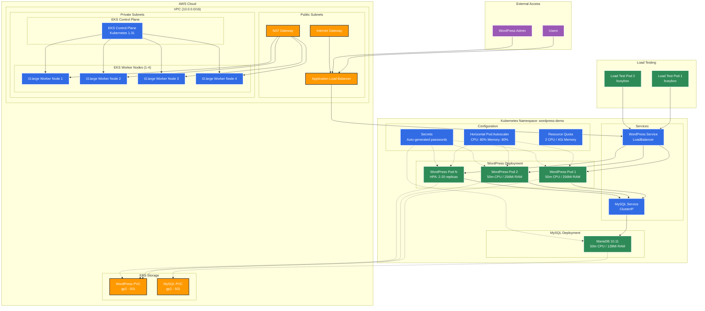

# Jamf DevOps Engineer II - Technical Assignment

## WordPress on EKS Implementation

This project demonstrates a WordPress deployment on Amazon EKS or local cluster for the Jamf DevOps Engineer II (Kubernetes) role technical interview.

## Table of Contents

- [Jamf DevOps Engineer II - Technical Assignment](#jamf-devops-engineer-ii---technical-assignment)
  - [WordPress on EKS Implementation](#wordpress-on-eks-implementation)
  - [Table of Contents](#table-of-contents)
  - [Quick Start](#quick-start)
    - [Prerequisites](#prerequisites)
    - [1. Deploy EKS Cluster](#1-deploy-eks-cluster)
    - [2. Deploy WordPress with Helm](#2-deploy-wordpress-with-helm)
      - [For AWS EKS (Production)](#for-aws-eks-production)
      - [For Local Kind Cluster (Development)](#for-local-kind-cluster-development)
    - [3. Test Autoscaling](#3-test-autoscaling)
  - [Accessing WordPress](#accessing-wordpress)
    - [AWS EKS (AWS Load Balancer Controller)](#aws-eks-aws-load-balancer-controller)
    - [Port Forwarding (Any Environment)](#port-forwarding-any-environment)
  - [Project Structure](#project-structure)
  - [Architecture Overview](#architecture-overview)
    - [Key Components](#key-components)
  - [Resource Management \& Scaling](#resource-management--scaling)
    - [Namespace Resource Quotas](#namespace-resource-quotas)
    - [HPA Configuration](#hpa-configuration)
    - [Resource Limits Per Pod](#resource-limits-per-pod)
    - [Rationale](#rationale)
  - [Demo Flow \& Key Points](#demo-flow--key-points)
    - [1. Infrastructure (Terraform)](#1-infrastructure-terraform)
    - [2. Application (Helm)](#2-application-helm)
    - [3. Scaling Demonstration](#3-scaling-demonstration)
  - [Helm vs Plain Kubernetes Manifests](#helm-vs-plain-kubernetes-manifests)
    - [Helm Advantages](#helm-advantages)
    - [Plain Manifests Advantages](#plain-manifests-advantages)
    - [Example Comparison](#example-comparison)
  - [Security Considerations](#security-considerations)
    - [Current Implementation](#current-implementation)
    - [Production Hardening Recommendations](#production-hardening-recommendations)
    - [Identified Vulnerabilities](#identified-vulnerabilities)
  - [High Availability Configuration](#high-availability-configuration)
    - [Current Demo Setup](#current-demo-setup)
    - [Production HA Recommendations](#production-ha-recommendations)
  - [Troubleshooting](#troubleshooting)
    - [Common Commands](#common-commands)
    - [Common Issues](#common-issues)
  - [Cost Optimization](#cost-optimization)
  - [Cleanup](#cleanup)
  - [Resources Used](#resources-used)
  - [Author](#author)

## Quick Start

### Prerequisites

- AWS CLI configured with appropriate permissions
- Terraform >= 1.0
- kubectl
- Helm 3.x

### 1. Deploy EKS Cluster

```bash
cd terraform/environments/demo
terraform init
terraform plan
terraform apply

# Update kubeconfig
aws eks update-kubeconfig --region us-east-2 --name jamf-demo-cluster
kubectl get nodes
```

### 2. Deploy WordPress with Helm

#### For AWS EKS (Production)

1. **Install Metrics Server** (required for HPA)
   - See [helm/metrics-server/README.md](helm/metrics-server/README.md) for detailed installation instructions
   - Use production configuration: `helm/metrics-server/values-prod.yaml`

2. **Install AWS Load Balancer Controller** (optional, for LoadBalancer services)
   - See [helm/aws-load-balancer-controller/README.md](helm/aws-load-balancer-controller/README.md) for setup instructions

3. **Deploy WordPress**
   - See [helm/wordpress/README.md](helm/wordpress/README.md) for complete deployment guide
   - Use EKS demo configuration: `helm/wordpress/values-eks-demo.yaml`

#### For Local Kind Cluster (Development)

1. **Install Metrics Server** (required for HPA)
   - See [helm/metrics-server/README.md](helm/metrics-server/README.md) for detailed installation instructions
   - Use development configuration: `helm/metrics-server/values-dev.yaml`

2. **Deploy WordPress**
   - See [helm/wordpress/README.md](helm/wordpress/README.md) for complete deployment guide
   - Use dev configuration: `helm/wordpress/values-dev.yaml`

### 3. Test Autoscaling

```bash
# Start load test
./scripts/load-test-demo.sh start

# Monitor scaling
./scripts/load-test-demo.sh status

# Stop load test
./scripts/load-test-demo.sh stop
```

## Accessing WordPress

Once deployed, you can access your WordPress site using one of the following methods:

### AWS EKS (AWS Load Balancer Controller)

The chart uses LoadBalancer services which work with the AWS Load Balancer Controller to provision Application Load Balancers:

```bash
# Check if AWS Load Balancer Controller is installed
kubectl get pods -n kube-system | grep aws-load-balancer-controller

# Get the external load balancer URL (provisioned by AWS Load Balancer Controller)
kubectl get svc wordpress -n wordpress-demo

# Wait for EXTERNAL-IP to be assigned (may take 2-3 minutes)
# Access WordPress at: http://<EXTERNAL-IP>
```

**Benefits with AWS Load Balancer Controller:**

- Provisions Application Load Balancer (ALB) instead of Classic Load Balancer
- Better performance and cost optimization
- Advanced routing and SSL/TLS support capabilities

**Optional: Create Custom Ingress**

For advanced routing, you can create an Ingress resource:

```yaml
# Save as wordpress-ingress.yaml
apiVersion: networking.k8s.io/v1
kind: Ingress
metadata:
  name: wordpress-ingress
  namespace: wordpress-demo
  annotations:
    kubernetes.io/ingress.class: alb
    alb.ingress.kubernetes.io/scheme: internet-facing
spec:
  rules:
  - http:
      paths:
      - path: /
        pathType: Prefix
        backend:
          service:
            name: wordpress
            port:
              number: 80
```

```bash
# Apply the Ingress
kubectl apply -f wordpress-ingress.yaml

# Get the ALB URL
kubectl get ingress wordpress-ingress -n wordpress-demo
```

### Port Forwarding (Any Environment)

```bash
# Forward local port 8080 to WordPress service
kubectl port-forward svc/wordpress 8080:80 -n wordpress-demo

# Access WordPress at: http://localhost:8080
```

## Project Structure

```
├── terraform/                        # Infrastructure as Code
│   ├── environments/                 # Environment-specific configurations
│   └── modules/                      # Reusable Terraform modules
├── helm/                             # Helm charts and configurations
│   ├── aws-load-balancer-controller/ # AWS Load Balancer Controller
│   ├── metrics-server/               # Kubernetes metrics server
│   └── wordpress/                    # WordPress Helm chart
│       └── templates/                # Kubernetes manifests
├── scripts/                          # Automation and testing scripts
└── docs/                             # Project documentation
```

## Architecture Overview



### Key Components

- **EKS Cluster**: Kubernetes 1.31, 1-4 worker nodes (t3.large)
- **WordPress**: 2-20 pods with HPA (CPU/Memory based scaling)
- **MySQL**: Single pod with persistent storage (MariaDB 10.11)
- **Storage**: EBS volumes via CSI driver (gp2, 5Gi each)
- **Networking**: VPC (10.0.0.0/16) with public/private subnets, single NAT gateway
- **Security**: Pod Security Standards (baseline), RBAC, secrets management

## Resource Management & Scaling

### Namespace Resource Quotas

```yaml
requests.cpu: "2"             # Total CPU requests
requests.memory: 4Gi          # Total memory requests  
limits.cpu: "4"               # Total CPU limits
limits.memory: 8Gi            # Total memory limits
pods: "20"                    # Maximum pods
persistentvolumeclaims: "5"   # Maximum PVCs
```

### HPA Configuration

- **Min replicas**: 2, **Max replicas**: 20
- **Scale up triggers**: CPU > 80% OR Memory > 80%
- **Scale down**: After 5 minutes of low usage
- **Target resources**: WordPress deployment only

### Resource Limits Per Pod

- **WordPress**: 200m CPU / 512Mi memory (limits), 50m CPU / 256Mi memory (requests)
- **MySQL/MariaDB**: 200m CPU / 256Mi memory (limits), 50m CPU / 128Mi memory (requests)

### Rationale

- **Demo sizing**: Cost-effective for demonstration purposes
- **Production**: Would use larger instances, multi-AZ, managed RDS
- **Scaling**: Conservative limits to demonstrate HPA behavior

## Demo Flow & Key Points

### 1. Infrastructure (Terraform)

**Show**: `terraform/environments/demo/main.tf`

- EKS cluster with managed node groups
- VPC with public/private subnets
- IRSA for AWS service integration
- Cost optimizations (single NAT gateway)

### 2. Application (Helm)

**Show**: `helm/wordpress/` structure

- Templated Kubernetes manifests
- Parameterized configuration via values
- Resource management and security policies

### 3. Scaling Demonstration

**Commands**:

```bash
# Show baseline
./scripts/load-test-demo.sh status

# Generate load (2 busybox pods making continuous requests)
./scripts/load-test-demo.sh start

# Watch scaling in real-time
kubectl get hpa -n wordpress-demo -w

# Stop load test
./scripts/load-test-demo.sh stop
```

## Helm vs Plain Kubernetes Manifests

### Helm Advantages

- **Templating**: Parameterized configurations with values.yaml
- **Release Management**: Easy upgrades, rollbacks, and versioning
- **Dependency Management**: Chart dependencies and sub-charts
- **Package Distribution**: Reusable charts across environments
- **Operational Efficiency**: Single command deployment

### Plain Manifests Advantages  

- **Transparency**: Direct YAML, no abstraction layer
- **GitOps Friendly**: Better for declarative workflows
- **Debugging**: Easier to troubleshoot issues
- **No Dependencies**: Just kubectl required
- **Full Control**: Complete visibility into all resources

### Example Comparison

**Helm deployment**:

```bash
helm upgrade --install wordpress helm/wordpress -f helm/wordpress/values-eks-demo.yaml
```

**Equivalent plain manifests** would require:

- Manual value substitution
- Individual kubectl apply commands
- Manual rollback procedures

## Security Considerations

### Current Implementation

- **Pod Security Standards**: Baseline enforcement
- **Secrets Management**: Kubernetes secrets for passwords
- **Resource Limits**: CPU/memory quotas and limits
- **RBAC**: EKS managed permissions
- **Network**: Private subnets for worker nodes

### Production Hardening Recommendations

1. **Enhanced Secrets**: AWS Secrets Manager integration
2. **Network Policies**: Micro-segmentation between pods
3. **Pod Security**: Restricted standards instead of baseline
4. **Image Security**: Container scanning and signed images
5. **Access Control**: Fine-grained RBAC and audit logging
6. **Monitoring**: Comprehensive observability stack

### Identified Vulnerabilities

- Secrets stored as base64 (not encrypted at rest)
- No network policies (pods can communicate freely)
- Public container images without scanning
- Broad permissions for demo simplicity

## High Availability Configuration

### Current Demo Setup

- **Single AZ**: Cost optimization for demonstration
- **Single MySQL**: Simple deployment, not HA
- **Basic Monitoring**: Kubernetes metrics only

### Production HA Recommendations

- **Multi-AZ Deployment**: 3 availability zones minimum
- **Database**: RDS MySQL with Multi-AZ failover
- **Load Balancing**: Application Load Balancer with health checks
- **Storage**: Cross-AZ persistent volumes
- **Networking**: Multiple NAT gateways for redundancy
- **Backup**: Automated backup and disaster recovery

## Troubleshooting

### Common Commands

```bash
# Check cluster status
kubectl get nodes
kubectl cluster-info

# Application status
kubectl get all -n wordpress-demo
kubectl describe hpa wordpress -n wordpress-demo

# Logs and debugging
kubectl logs -f deployment/wordpress -n wordpress-demo
kubectl logs -f deployment/wordpress-mysql -n wordpress-demo

# Resource usage
kubectl top nodes
kubectl top pods -n wordpress-demo
```

### Common Issues

1. **HPA not scaling**: Check metrics-server installation
2. **Pods pending**: Check resource quotas and node capacity
3. **LoadBalancer pending**: Verify AWS Load Balancer Controller
4. **Database connection**: Check MySQL pod logs and secrets

## Cost Optimization

- **Single NAT Gateway**: ~$45/month savings vs multi-AZ
- **t3.large instances**: Cost-effective for demo workloads
- **gp2 storage**: Standard EBS volumes
- **Resource limits**: Prevent resource waste

**Estimated monthly cost**: ~$150-200 for demo cluster

## Cleanup

```bash
# Remove WordPress
helm uninstall wordpress -n wordpress-demo
kubectl delete namespace wordpress-demo

# Destroy infrastructure
cd terraform/environments/demo
terraform destroy
```

## Resources Used

- **AWS EKS Documentation**: [Best practices and configuration](https://docs.aws.amazon.com/eks/latest/userguide/best-practices.html)
- **Terraform AWS Modules**: [Standardized VPC](https://registry.terraform.io/modules/terraform-aws-modules/vpc/aws/latest), [EKS module](https://registry.terraform.io/modules/terraform-aws-modules/eks/aws/latest), and [AWS Load Balancer Controller]()
- **Kubernetes Documentation**: [HPA](https://kubernetes.io/docs/tasks/run-application/horizontal-pod-autoscale/) and [resource management](https://kubernetes.io/docs/concepts/configuration/manage-resources-containers/)
- **Helm Documentation**: [Chart development](https://helm.sh/docs/chart_template_guide/) and [templating](https://helm.sh/docs/chart_template_guide/getting_started/)
- **Community Examples**: [WordPress deployment patterns](https://kubernetes.io/docs/tutorials/stateful-application/mysql-wordpress-persistent-volume/)

## Author

Kyle McIntire - Jamf DevOps Engineer II Technical Interview

---

*This implementation demonstrates practical Kubernetes skills with considerations for cost, security, and operational efficiency while maintaining production-ready patterns.*
