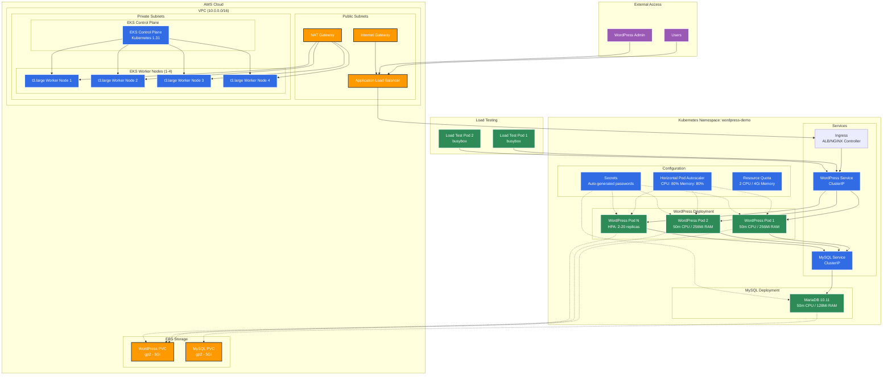

# Jamf DevOps Engineer II - Technical Assignment

## WordPress on EKS Implementation

This project demonstrates a WordPress deployment on Amazon EKS or local cluster for the Jamf DevOps Engineer II (Kubernetes) role technical interview.

## Table of Contents

- [Jamf DevOps Engineer II - Technical Assignment](#jamf-devops-engineer-ii---technical-assignment)
  - [WordPress on EKS Implementation](#wordpress-on-eks-implementation)
  - [Table of Contents](#table-of-contents)
  - [Quick Start](#quick-start)
    - [Prerequisites](#prerequisites)
    - [1. Deploy EKS Cluster](#1-deploy-eks-cluster)
    - [2. Deploy WordPress with Helm](#2-deploy-wordpress-with-helm)
      - [For AWS EKS (Production)](#for-aws-eks-production)
      - [For Local Kind Cluster (Development)](#for-local-kind-cluster-development)
    - [3. Test Autoscaling](#3-test-autoscaling)
  - [Accessing WordPress](#accessing-wordpress)
    - [AWS EKS (Application Load Balancer)](#aws-eks-application-load-balancer)
    - [Local KIND Cluster (NGINX Ingress)](#local-kind-cluster-nginx-ingress)
    - [Ingress Architecture Benefits](#ingress-architecture-benefits)
    - [Adding Additional Services](#adding-additional-services)
    - [Port Forwarding (Fallback Method)](#port-forwarding-fallback-method)
  - [Project Structure](#project-structure)
  - [Architecture Overview](#architecture-overview)
    - [Key Components](#key-components)
  - [Resource Management \& Scaling](#resource-management--scaling)
    - [Namespace Resource Quotas](#namespace-resource-quotas)
    - [HPA Configuration](#hpa-configuration)
    - [Resource Limits Per Pod](#resource-limits-per-pod)
    - [Rationale](#rationale)
  - [Demo Flow \& Key Points](#demo-flow--key-points)
    - [1. Infrastructure (Terraform)](#1-infrastructure-terraform)
    - [2. Application (Helm)](#2-application-helm)
    - [3. Scaling Demonstration](#3-scaling-demonstration)
  - [Helm vs Plain Kubernetes Manifests](#helm-vs-plain-kubernetes-manifests)
    - [Helm Advantages](#helm-advantages)
    - [Plain Manifests Advantages](#plain-manifests-advantages)
    - [Example Comparison](#example-comparison)
  - [Security Considerations](#security-considerations)
    - [Current Implementation](#current-implementation)
    - [Production Hardening Recommendations](#production-hardening-recommendations)
    - [Identified Vulnerabilities](#identified-vulnerabilities)
  - [High Availability Configuration](#high-availability-configuration)
    - [Current Demo Setup](#current-demo-setup)
    - [Production HA Recommendations](#production-ha-recommendations)
  - [Troubleshooting](#troubleshooting)
    - [Common Commands](#common-commands)
    - [Common Issues](#common-issues)
  - [Cost Optimization](#cost-optimization)
  - [Cleanup](#cleanup)
  - [Resources Used](#resources-used)
  - [Author](#author)

## Quick Start

### Prerequisites

- AWS CLI configured with appropriate permissions
- Terraform >= 1.0
- kubectl
- Helm 3.x

### 1. Deploy EKS Cluster

```bash
cd terraform/environments/demo
terraform init
terraform plan
terraform apply

# Update kubeconfig
aws eks update-kubeconfig --region us-east-2 --name jamf-demo-cluster
kubectl get nodes
```

### 2. Deploy WordPress with Helm

#### For AWS EKS (Production)

1. **Install Metrics Server** (required for HPA)
   - See [helm/metrics-server/README.md](helm/metrics-server/README.md) for detailed installation instructions
   - Use production configuration: `helm/metrics-server/values-prod.yaml`

2. **Install AWS Load Balancer Controller** (optional, for LoadBalancer services)
   - See [helm/aws-load-balancer-controller/README.md](helm/aws-load-balancer-controller/README.md) for setup instructions

3. **Deploy WordPress**
   - See [helm/wordpress/README.md](helm/wordpress/README.md) for complete deployment guide
   - Use EKS demo configuration: `helm/wordpress/values-eks-demo.yaml`

#### For Local Kind Cluster (Development)

1. **Create KIND cluster with ingress support**

   ```bash
   # Create cluster with proper port mapping
   kind create cluster --name jamf-hw --config kind-config.yaml
   ```

2. **Install NGINX Ingress Controller**

   ```bash
   kubectl apply -f k8s/nginx-ingress.yaml
   kubectl wait --namespace ingress-nginx --for=condition=ready pod --selector=app.kubernetes.io/component=controller --timeout=90s
   ```

3. **Install Metrics Server** (required for HPA)
   - See [helm/metrics-server/README.md](helm/metrics-server/README.md) for detailed installation instructions
   - Use development configuration: `helm/metrics-server/values-dev.yaml`

4. **Deploy WordPress**
   - See [helm/wordpress/README.md](helm/wordpress/README.md) for complete deployment guide
   - Use dev configuration: `helm/wordpress/values-dev.yaml`

5. **Add local DNS entries**

   ```bash
   echo "127.0.0.1 wordpress.local" | sudo tee -a /etc/hosts
   ```

### 3. Test Autoscaling

```bash
# Start load test
./scripts/load-test-demo.sh start

# Monitor scaling
./scripts/load-test-demo.sh status

# Stop load test
./scripts/load-test-demo.sh stop
```

## Accessing WordPress

The deployment uses **ingress-based routing** with a shared load balancer for cost efficiency and better resource utilization.

### AWS EKS (Application Load Balancer)

The chart uses ingress resources with the AWS Load Balancer Controller to provision a single Application Load Balancer:

```bash
# Check if AWS Load Balancer Controller is installed
kubectl get pods -n kube-system | grep aws-load-balancer-controller

# Get the ingress URL (provisioned by AWS Load Balancer Controller)
kubectl get ingress wordpress -n wordpress-demo

# Access WordPress at the ALB URL shown in ADDRESS column
```

### Local KIND Cluster (NGINX Ingress)

For local development, the chart uses NGINX Ingress Controller with host-based routing:

```bash
# Deploy NGINX Ingress Controller
kubectl apply -f k8s/nginx-ingress.yaml

# Wait for controller to be ready
kubectl wait --namespace ingress-nginx --for=condition=ready pod --selector=app.kubernetes.io/component=controller --timeout=90s

# Add local DNS entries
echo "127.0.0.1 wordpress.local" | sudo tee -a /etc/hosts

# Access WordPress at: http://wordpress.local
```

### Ingress Architecture Benefits

- **Single Load Balancer**: One ALB/NGINX controller handles multiple services
- **Cost Effective**: ~$16/month savings per additional service (no per-service LoadBalancer)
- **Host-Based Routing**: Clean separation with dedicated domains per service
- **Scalable**: Easy to add more services with additional ingress rules

### Adding Additional Services

To add more services to the shared ingress:

```yaml
# Example: API service with its own domain
apiVersion: networking.k8s.io/v1
kind: Ingress
metadata:
  name: api-ingress
  namespace: wordpress-demo
spec:
  ingressClassName: nginx  # or 'alb' for AWS
  rules:
  - host: api.local  # or api.yourdomain.com for AWS
    http:
      paths:
      - path: /
        pathType: Prefix
        backend:
          service:
            name: api-service
            port:
              number: 80
```

### Port Forwarding (Fallback Method)

```bash
# Forward local port 8080 to WordPress service
kubectl port-forward svc/wordpress 8080:80 -n wordpress-demo

# Access WordPress at: http://localhost:8080
```

## Project Structure

```text
.
├── docs/                                    # Documentation and analysis
│   ├── Cost Estimate.md                     # AWS cost breakdown and optimization analysis
│   └── Kubernetes - Homework-2.md           # Technical assignment requirements
├── helm/                                    # Helm charts for Kubernetes deployments
│   ├── aws-load-balancer-controller/        # AWS ALB Controller configuration
│   │   ├── README.md                        # Installation and configuration guide
│   │   └── values.yaml                      # Helm values for ALB controller
│   ├── metrics-server/                      # Kubernetes metrics server for HPA
│   │   ├── README.md                        # Setup instructions for metrics collection
│   │   ├── values-dev.yaml                  # Development environment configuration
│   │   └── values-prod.yaml                 # Production environment configuration
│   └── wordpress/                           # WordPress application Helm chart
│       ├── Chart.yaml                       # Chart metadata and dependencies
│       ├── README.md                        # WordPress deployment guide
│       ├── templates/                       # Kubernetes manifest templates
│       │   ├── _helpers.tpl                 # Helm template helpers and functions
│       │   ├── hpa.yaml                     # Horizontal Pod Autoscaler configuration
│       │   ├── mysql-service.yaml           # MySQL database service definition
│       │   ├── mysql-statefulset.yaml       # MySQL StatefulSet with persistent storage
│       │   ├── namespace.yaml               # Kubernetes namespace with resource quotas
│       │   ├── secrets.yaml                 # Database credentials and WordPress secrets
│       │   ├── wordpress-deployment.yaml    # WordPress application deployment
│       │   ├── wordpress-ingress.yaml       # Ingress routing configuration
│       │   ├── wordpress-pvc.yaml           # Persistent volume claim for WordPress files
│       │   └── wordpress-service.yaml       # WordPress service definition
│       ├── values-dev.yaml                  # Local KIND cluster configuration
│       └── values-eks-demo.yaml             # AWS EKS production configuration
├── k8s/                                     # Plain Kubernetes manifests
│   ├── api-service.yaml                     # Example API service for ingress demo
│   ├── kind-config.yaml                     # KIND cluster configuration with ingress
│   └── nginx-ingress.yaml                   # NGINX ingress controller for local dev
├── README.md                                # Main project documentation
├── scripts/                                 # Automation and utility scripts
│   ├── cost-monitor.sh                      # AWS cost monitoring and alerts
│   ├── load-test-demo.sh                    # Load testing and HPA demonstration
│   └── terraform-state-setup.sh             # Terraform remote state initialization
└── terraform/                               # Infrastructure as Code
    ├── environments/                        # Environment-specific configurations
    │   ├── demo/                            # Demo environment for technical interview
    │   │   ├── backend.tf                   # Remote state backend configuration
    │   │   ├── main.tf                      # EKS cluster and VPC infrastructure
    │   │   ├── outputs.tf                   # Terraform outputs (cluster info, etc.)
    │   │   └── variables.tf                 # Input variables and configuration
    │   └── staging/                         # Staging environment (placeholder)
    └── modules/                             # Reusable Terraform modules (empty)
```

## Architecture Overview



### Key Components

- **EKS Cluster**: Kubernetes 1.31, 1-4 worker nodes (t3.large)
- **WordPress**: 2-20 pods with HPA (CPU/Memory based scaling)
- **MySQL**: Single pod with persistent storage (MariaDB 10.11)
- **Ingress**: Single ALB/NGINX controller with host-based routing
- **Storage**: EBS volumes via CSI driver (gp2, 5Gi each)
- **Networking**: VPC (10.0.0.0/16) with public/private subnets, single NAT gateway
- **Security**: Pod Security Standards (baseline), RBAC, secrets management

## Resource Management & Scaling

### Namespace Resource Quotas

```yaml
requests.cpu: "2"             # Total CPU requests
requests.memory: 4Gi          # Total memory requests  
limits.cpu: "4"               # Total CPU limits
limits.memory: 8Gi            # Total memory limits
pods: "20"                    # Maximum pods
persistentvolumeclaims: "5"   # Maximum PVCs
```

### HPA Configuration

- **Min replicas**: 2, **Max replicas**: 20
- **Scale up triggers**: CPU > 80% OR Memory > 80%
- **Scale down**: After 5 minutes of low usage
- **Target resources**: WordPress deployment only

### Resource Limits Per Pod

- **WordPress**: 200m CPU / 512Mi memory (limits), 50m CPU / 256Mi memory (requests)
- **MySQL/MariaDB**: 200m CPU / 256Mi memory (limits), 50m CPU / 128Mi memory (requests)

### Rationale

- **Demo sizing**: Cost-effective for demonstration purposes
- **Production**: Would use larger instances, multi-AZ, managed RDS
- **Scaling**: Conservative limits to demonstrate HPA behavior

## Demo Flow & Key Points

### 1. Infrastructure (Terraform)

**Show**: `terraform/environments/demo/main.tf`

- EKS cluster with managed node groups
- VPC with public/private subnets
- IRSA for AWS service integration
- Cost optimizations (single NAT gateway)

### 2. Application (Helm)

**Show**: `helm/wordpress/` structure

- Templated Kubernetes manifests
- Parameterized configuration via values
- Resource management and security policies

### 3. Scaling Demonstration

**Commands**:

```bash
# Show baseline
./scripts/load-test-demo.sh status

# Generate load (2 busybox pods making continuous requests)
./scripts/load-test-demo.sh start

# Watch scaling in real-time
kubectl get hpa -n wordpress-demo -w

# Stop load test
./scripts/load-test-demo.sh stop
```

## Helm vs Plain Kubernetes Manifests

### Helm Advantages

- **Templating**: Parameterized configurations with values.yaml
- **Release Management**: Easy upgrades, rollbacks, and versioning
- **Dependency Management**: Chart dependencies and sub-charts
- **Package Distribution**: Reusable charts across environments
- **Operational Efficiency**: Single command deployment

### Plain Manifests Advantages  

- **Transparency**: Direct YAML, no abstraction layer
- **GitOps Friendly**: Better for declarative workflows
- **Debugging**: Easier to troubleshoot issues
- **No Dependencies**: Just kubectl required
- **Full Control**: Complete visibility into all resources

### Example Comparison

**Helm deployment**:

```bash
helm upgrade --install wordpress helm/wordpress -f helm/wordpress/values-eks-demo.yaml
```

**Equivalent plain manifests** would require:

- Manual value substitution
- Individual kubectl apply commands
- Manual rollback procedures

## Security Considerations

### Current Implementation

- **Pod Security Standards**: Baseline enforcement
- **Secrets Management**: Kubernetes secrets for passwords
- **Resource Limits**: CPU/memory quotas and limits
- **RBAC**: EKS managed permissions
- **Network**: Private subnets for worker nodes

### Production Hardening Recommendations

1. **Enhanced Secrets**: AWS Secrets Manager integration
2. **Network Policies**: Micro-segmentation between pods
3. **Pod Security**: Restricted standards instead of baseline
4. **Image Security**: Container scanning and signed images
5. **Access Control**: Fine-grained RBAC and audit logging
6. **Monitoring**: Comprehensive observability stack

### Identified Vulnerabilities

- Secrets stored as base64 (not encrypted at rest)
- No network policies (pods can communicate freely)
- Public container images without scanning
- Broad permissions for demo simplicity

## High Availability Configuration

### Current Demo Setup

- **Single AZ**: Cost optimization for demonstration
- **Single MySQL**: Simple deployment, not HA
- **Basic Monitoring**: Kubernetes metrics only

### Production HA Recommendations

- **Multi-AZ Deployment**: 3 availability zones minimum
- **Database**: RDS MySQL with Multi-AZ failover
- **Load Balancing**: Application Load Balancer with health checks
- **Storage**: Cross-AZ persistent volumes
- **Networking**: Multiple NAT gateways for redundancy
- **Backup**: Automated backup and disaster recovery

## Troubleshooting

### Common Commands

```bash
# Check cluster status
kubectl get nodes
kubectl cluster-info

# Application status
kubectl get all -n wordpress-demo
kubectl describe hpa wordpress -n wordpress-demo

# Logs and debugging
kubectl logs -f deployment/wordpress -n wordpress-demo
kubectl logs -f deployment/wordpress-mysql -n wordpress-demo

# Resource usage
kubectl top nodes
kubectl top pods -n wordpress-demo
```

### Common Issues

1. **HPA not scaling**: Check metrics-server installation
2. **Pods pending**: Check resource quotas and node capacity
3. **LoadBalancer pending**: Verify AWS Load Balancer Controller
4. **Database connection**: Check MySQL pod logs and secrets

## Cost Optimization

- **Single NAT Gateway**: ~$45/month savings vs multi-AZ
- **Shared Ingress Controller**: ~$16/month savings per additional service
- **t3.large instances**: Cost-effective for demo workloads
- **gp2 storage**: Standard EBS volumes
- **Resource limits**: Prevent resource waste

**Estimated monthly cost**: ~$129-137 for demo cluster (see [docs/Cost Estimate.md](docs/Cost%20Estimate.md))

## Cleanup

```bash
# Remove WordPress
helm uninstall wordpress -n wordpress-demo
kubectl delete namespace wordpress-demo

# Destroy infrastructure
cd terraform/environments/demo
terraform destroy
```

## Resources Used

- **AWS EKS Documentation**: [Best practices and configuration](https://docs.aws.amazon.com/eks/latest/userguide/best-practices.html)
- **Terraform AWS Modules**: [Standardized VPC](https://registry.terraform.io/modules/terraform-aws-modules/vpc/aws/latest), [EKS module](https://registry.terraform.io/modules/terraform-aws-modules/eks/aws/latest), and [AWS Load Balancer Controller](https://kubernetes-sigs.github.io/aws-load-balancer-controller/)
- **Kubernetes Documentation**: [HPA](https://kubernetes.io/docs/tasks/run-application/horizontal-pod-autoscale/) and [resource management](https://kubernetes.io/docs/concepts/configuration/manage-resources-containers/)
- **Helm Documentation**: [Chart development](https://helm.sh/docs/chart_template_guide/) and [templating](https://helm.sh/docs/chart_template_guide/getting_started/)
- **Community Examples**: [WordPress deployment patterns](https://kubernetes.io/docs/tutorials/stateful-application/mysql-wordpress-persistent-volume/)

## Author

Kyle McIntire - Jamf DevOps Engineer II Technical Interview

---

*This implementation demonstrates practical Kubernetes skills with considerations for cost, security, and operational efficiency while maintaining production-ready patterns.*
